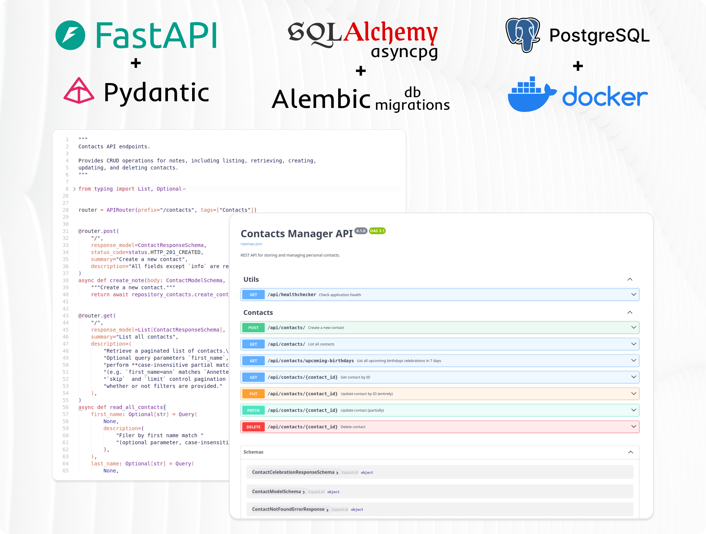

# Fullstack Web Development with Python <!-- omit in toc -->

### [# goit-pythonweb-hw-08](https://github.com/topics/goit-pythonweb-hw-08) <!-- omit in toc -->

<p align="center">
  
</p>

## Building a REST API for Contact Management using FastAPI. <!-- omit in toc -->

This project demonstrates the use of **FastAPI** to build a REST API for managing personal contacts, along with **SQLAlchemy ORM** for relational **PostgreSQL** database operations, and **Alembic** for schema migrations.

<p align="center">
  
</p>

The app allows storing and managing contacts with fields like `first_name`, `last_name`, `email`, `phone_number`, `birthdate`, and optional additional info.

Main features:
* Full CRUD operations for managing contacts.
* Search functionality by first name, last name, or email.
* Retrieve contacts with upcoming birthdays (next 7 days).
* SQLAlchemy ORM modeling and Alembic migrations.
* Swagger/OpenAPI documentation automatically generated by FastAPI.
* Pydantic models for request validation and data serialization.

## Table of Contents <!-- omit in toc -->
- [Task Requirements](#task-requirements)
  - [Goal](#goal)
  - [Technical Specification](#technical-specification)
    - [1. Contacts](#1-contacts)
    - [2. API](#2-api)
    - [3. CRUD + Extra Features](#3-crud--extra-features)
  - [General Requirements](#general-requirements)
- [Task Solution](#task-solution)
  - [Solution Description](#solution-description)
  - [Project Setup \& Run Instructions](#project-setup--run-instructions)
    - [Prerequisites](#prerequisites)
    - [Setting Up the Development Environment](#setting-up-the-development-environment)
      - [1. Clone the Repository and Install Dependencies](#1-clone-the-repository-and-install-dependencies)
      - [2. Setup database](#2-setup-database)
      - [3. Setup application connection to the database](#3-setup-application-connection-to-the-database)
      - [4. Migrate and synchronize database ORM with database schema](#4-migrate-and-synchronize-database-orm-with-database-schema)
      - [5. Start FastAPI application](#5-start-fastapi-application)
      - [6. Access API docs and make API requests](#6-access-api-docs-and-make-api-requests)
- [License](#license)

## Task Requirements

### Goal

Create a REST API for storing and managing personal contacts.
The API must be built with FastAPI and use SQLAlchemy to work with a database.

### Technical Specification

#### 1. Contacts

Design a database to store contact information.

Each contact record must include:
* First name
* Last name
* Email address
* Phone number
* Birthday
* Additional information (optional)

#### 2. API

Develop an API, that should support basic data operations.

It must support following functions and provide endpoints to:
* Create a new contact
* Retrieve a list of all contacts
* Retrieve a single contact by its ID
* Update an existing contact
* Delete a contact

#### 3. CRUD + Extra Features

In addition to standard CRUD operations, the API must also:
* Allow searching contacts by first name, last name, or email using query parameters.
* Provide an endpoint to retrieve contacts who have birthdays within the next 7 days.

### General Requirements

1. Use FastAPI to implement the REST API.
2. Use SQLAlchemy ORM for database operations.
3. Use PostgreSQL as the database.
4. Support CRUD operations for contacts.
5. Store each contact's birthday.
6. Expose Swagger documentation for the REST API.
7. Validate request data with Pydantic models.

## Task Solution

### Solution Description

The solution consists of a **PostgreSQL database** running in a Docker container, a **FastAPI server** for handling HTTP API requests and managing contacts in the database, and **Swagger/OpenAPI documentation** that describes all available endpoints and allows you to try out requests directly from the documentation.

### Project Setup & Run Instructions

This guide will help you set up the environment and run the project.

#### Prerequisites

Before you begin, make sure you have the following installed:

* **[Python 3.11.*](https://www.python.org/downloads/)** (tested with Python 3.11.13) — Required to run the application locally.
* **[Poetry](https://python-poetry.org/)** - To manage dependencies in virtual environment.
* **[Docker](https://www.docker.com/)** using PostgreSQL (tested with PostgreSQL 17.5) — Used to containerize the application in a unified environment using Docker or Docker Compose.
* Optional - for local development:
  * **[Git](https://git-scm.com/downloads)** — To clone the repository, version control and development.
  * **[VS Code](https://code.visualstudio.com/download)** or another IDE — Recommended for browsing and editing the project source code, run using run scripts and overall development.
  * **DBeaver** or **PgAdmin** to access and see you PostgreSQL database information

#### Setting Up the Development Environment

##### 1. Clone the Repository and Install Dependencies

1. Clone repository:
    ```bash
    git clone https://github.com/oleksandr-romashko/goit-pythonweb-hw-08
    cd goit-pythonweb-hw-08
    ```
    or download the ZIP archive from [GitHub Repository](https://github.com/oleksandr-romashko/goit-pythonweb-hw-08) and extract it.
2. Install project dependencies:
    ```bash
    poetry install
    ```

##### 2. Setup database

Dada are stored in Postgres database. To easily setup our own one for testing purposes we may use Docker.

To create Postgres database in Docker container use following command:

```shell
docker run --name contacts-manager \
  -p 5432:5432 \
  -e POSTGRES_USER=app_user \
  -e POSTGRES_PASSWORD=your_db_password_here \
  -e POSTGRES_DB=contacts_app \
  -d postgres
```

where:
- `contacts-manager` - name of Docker container (you may set your own container name)
- `app_user` - Postgres username, setup with admin privileges by Docker
- `your_db_password_here` - password for the user (create your own one)
- `contacts_app` - database name to connect to
- `5432:5432` - exposed external/internal container ports to access postgres database from the outside
- `postgres` - Docker image name to base our container on (we use PostgreSQL, so `postgres` in our case)

##### 3. Setup application connection to the database

For app to access data in database we need correctly setup connection configuration.

There is [.env.example](./.env.example) in project root folder. Copy it and rename to `.env`. This file serves as a application configuration template and contains database connection settings (values should correspond to those, set during docker database creation):
```env
# ==========================
# Database Settings
# ==========================

# Hostname or IP of the PostgreSQL server
DB_HOST=0.0.0.0

# Port PostgreSQL listens on
DB_PORT=5432

# Name of the database your app will use
DB_NAME=contacts_app

# App-level PostgreSQL user and password
DB_USER=app_user
DB_PASSWORD=your_db_password_here
```

Make sure you `DB_PASSWORD` value correspond to `POSTGRES_PASSWORD` during Docker database creation.

Now our app should be set up to connect to our database in Docker container.

##### 4. Migrate and synchronize database ORM with database schema

As soon as we may connect to database we may perform queries. But our database has no tables or structure that conform to one set in ORM yet.

To comply our database with expected structure, execute following command:

```bash
poetry run alembic upgrade head
```

This will add tables with columns to database, that respect latest ORM structure.

```shell
$ poetry run alembic upgrade head
INFO  [alembic.runtime.migration] Context impl PostgresqlImpl.
INFO  [alembic.runtime.migration] Will assume transactional DDL.
INFO  [alembic.runtime.migration] Running upgrade  -> 0378c40d374e, Init
```

Other useful Alembic commands:

* `poetry run alembic downgrade base` - downgrade database to basic (initial at clone) state
* `poetry run alembic revision --autogenerate -m "revision message"` - automatically create new migration script
* `poetry run alembic history` - show migrations history
* `poetry run alembic current` - show current revision hash (useful to locate position in entire history)
* `poetry run alembic upgrade <revision hash>` - upgrade to certain revision
* `poetry run alembic downgrade <revision hash>` - downgrade to certain revision
* `poetry run alembic downgrade -1` - downgrade to the previous revision

##### 5. Start FastAPI application

Before we may start our FastAPI application it is wise to check our application settings. Check your `.env` file and change FastApi application settings if necessary:

```env
# ==========================
# FastAPI Application Settings
# ==========================

# Port on which the FastAPI app will run
WEB_PORT=3000

# Enable debug mode (also can trigger auto-reload in dev)
DEBUG=False
```

Then start FastApi application by using following command:

```shell
poetry run python -m src.main
```

This will start application and it will be accessible at [http://0.0.0.0:3000](http://0.0.0.0:3000) (depending on your `WEB_PORT` settings).

##### 6. Access API docs and make API requests

You may access Swagger API documentation at [http://0.0.0.0:3000/docs](http://0.0.0.0:3000/docs) and make API requests from there.

**Happy coding!**

## License

This project is licensed under the [MIT License](./LICENSE).
You are free to use, modify, and distribute this software in accordance with the terms of the license.